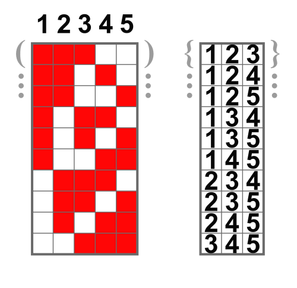

After searching the internet it seems all solution refer to the Fibonacci-Numbers.
The approach I used is to think about the number of k-combinations (see [Wikipedia](https://en.wikipedia.org/wiki/Combination)).
I thought: 
* I can decompose the number of stairs to a sum of 1's and 2'
* This sum will have `n` summands
* The number of combinations would be the positions where I can put a 1 (the red squares in the picture) in the formula (the white squares are the 2's)
* So the formula would be 
  * 
  * n = amount of positions of numbers in the sum formula
  * k = amount of 1's in the sum formula
* so for each amount of 1's I can get the combinations, which I have to sum up in the end

